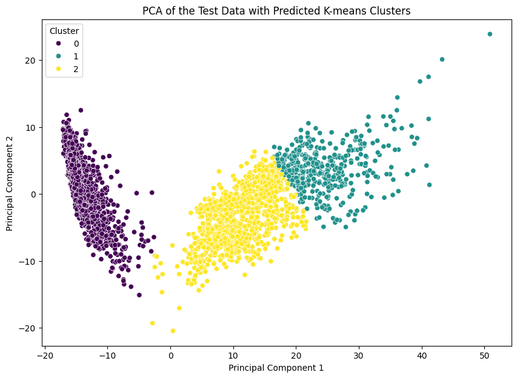

# Clustering — UCI Human Activity Recognition

**Status: exploratory / work in progress.** This is an ongoing unsupervised-learning exploration of the [UCI HAR dataset](https://archive.ics.uci.edu/dataset/240/human+activity+recognition+using+smartphones) — smartphone accelerometer/gyroscope readings labeled with one of six activities (walking, walking upstairs, walking downstairs, sitting, standing, laying). The goal is to see how well unsupervised methods recover the true activity labels without ever seeing them during fitting.

---

## Dataset

561 engineered time/frequency-domain features per sample, collected from 30 subjects performing six activities while wearing a waist-mounted smartphone. Loaded directly from the official `UCI HAR Dataset.zip`.

---

## Method

**1. Dimensionality reduction (PCA)**

Standardize the 561 features and project to 2 components for visualization and as input to clustering.


> Principal component 1 captures most of the variance and separates the dynamic activities (walking / upstairs / downstairs) from the static ones (sitting / standing / laying); component 2 adds a smaller amount of additional separation. Clusters are distinct but overlap at the boundaries between activities.

**2. K-Means clustering**

Cluster the PCA-reduced features with $k=6$ (matching the number of true activity classes) and compare against ground-truth labels via a confusion matrix.



**3. t-SNE**

A nonlinear embedding is also used to sanity-check the PCA-based grouping visually.

---

## Open questions / next steps

This notebook is still being iterated on — current TODOs:
- Compare K-Means cluster assignments against PCA components using a Jaccard score
- Per-subject time-series plots: one plot per activity, to see what separates static from dynamic activity signatures
- Sweep the number of PCA components fed into K-Means and measure the effect on classification accuracy
- Logistic regression baseline (on hold) as a supervised comparison point

---

## Setup

```bash
pip install pandas numpy scikit-learn matplotlib seaborn
```

Download the [UCI HAR Dataset](https://archive.ics.uci.edu/dataset/240/human+activity+recognition+using+smartphones), place `UCI HAR Dataset.zip` alongside the notebook, and run [`clustering.ipynb`](clustering.ipynb) top to bottom.
